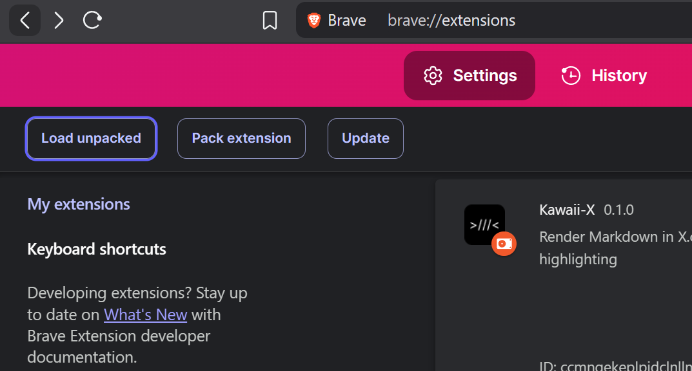

# **Kawaii-X**, Markdown Renderer for your tweets


Chrome extension for rendering Markdown in X.com tweets with syntax highlighting.

## Building

1. **Install dependencies**:
   ```bash
   bun install
   ```

2. **Build the extension**:
   ```bash
   bun run build
   ```

## Loading
- Open Chrome/Brave and go to `chrome://extensions/`
- Enable Developer Mode
- Click **Load Unpacked**

- Select `/extension` folder
  

---

Copyright © 2025-present ८४ Labs. :D